# __Node.js Application Deployment on Amazon Linux__

## Introduction
This project demonstrates how to deploy and run a Node.js appliaction on an Amazon Linux instance using yum package manager and pm2 for processs management.

## Prerequisites
* An Amazon Linux EC2 instance
* SSH access to the server 
* Basic Linux Command Knowledge
* Security Group configured to allow:
  
  * port 22 (SSH)-> to connect the server
  * port 3000 (your application's port): to acccess the Node.js application.
## Steps to Deploy
Step 1: Launch EC2 Instance  
 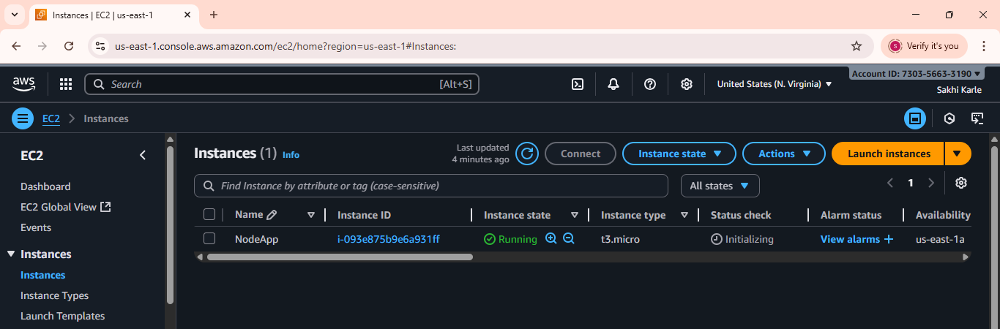

Step 2: Copy SSH key and Connect  via SSH using your key pair 
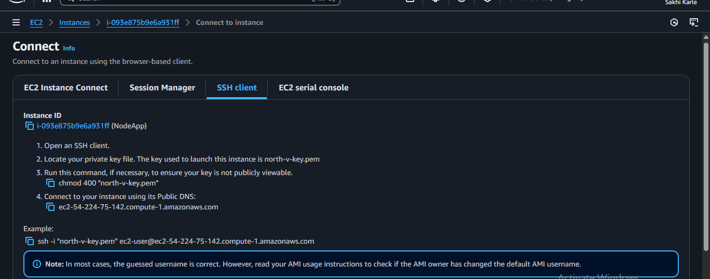

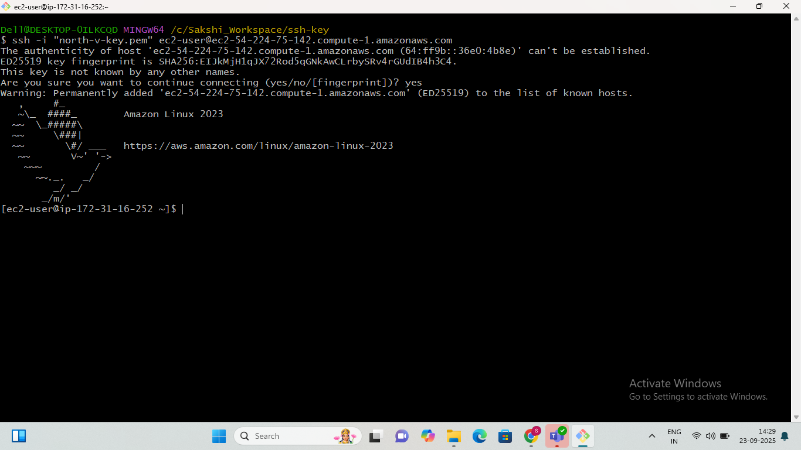

Step 3: Update Packages and Install npm and Node.js 

     sudo yum update -y
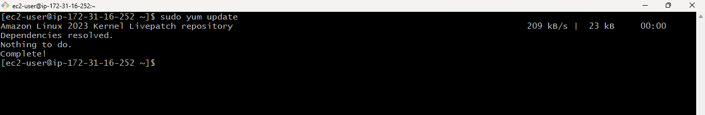

  1.install npm:

      sudo yum install npm -y
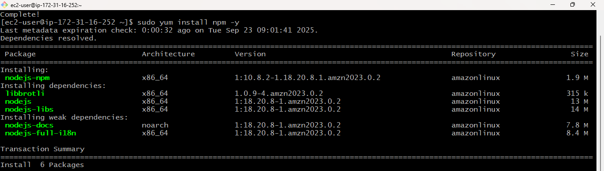
 

 2.install node.js:

     sudo yum install node.js -y
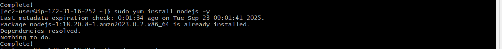

 3.Check the versions:

    node --version
    npm --version
 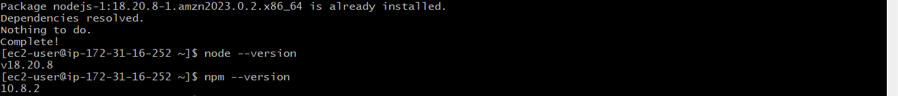   

Step 4: Install git and verify

    sudo yum install git -y
    git -version
 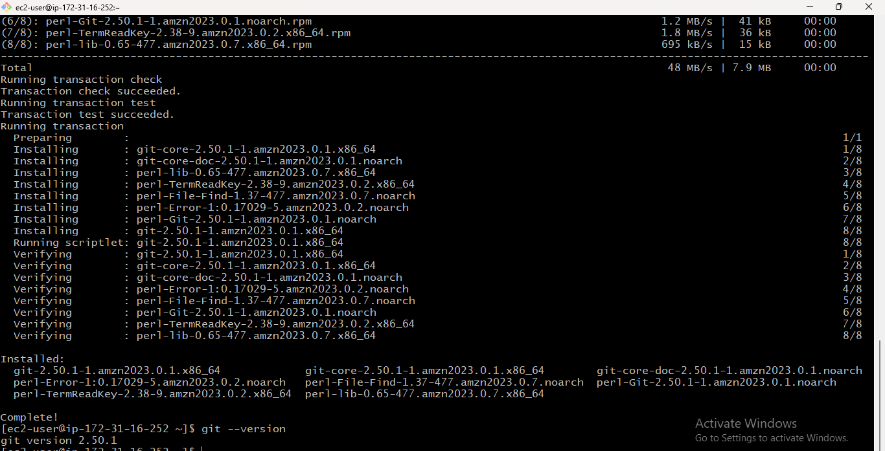  

 Step 5: Clone the Node.js application repository 

    git clone <git url>
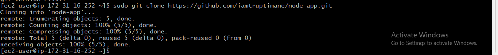
Step 6: Go inside the project folder(node-app)

    cd node-app
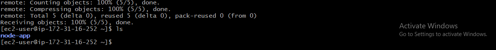

Step 7: Install Dependencies

#Install npm

    sudo npm install
#Run the application

    sudo npm start app.js
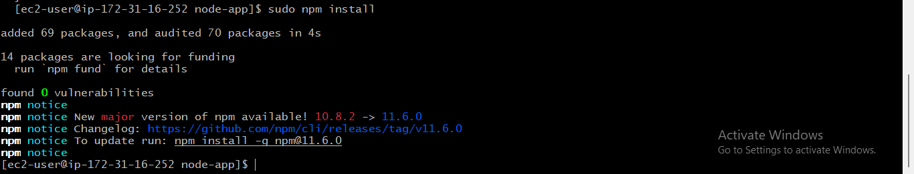

Step 8: Allow Port 3000 and Run the Application

1.Before running the application, ensure port 3000 is open in the Security Group to allow external access.
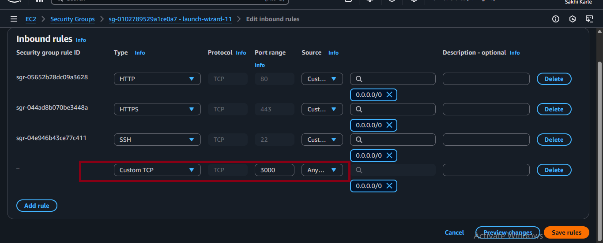

2.Then, run the app directly to test:

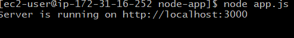

3.Open a browser and navigate to public ip to verify the application is running.

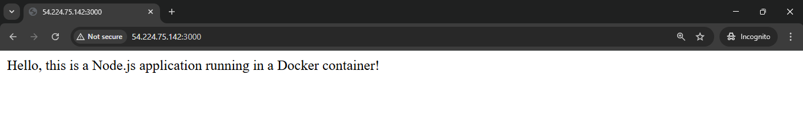

Step 9: Keep the app running(pm2)

#Install pm2 to run Node.js apps in the background

    sudo npm install -g pm2

#Run the Application 

    sudo npm start app.js
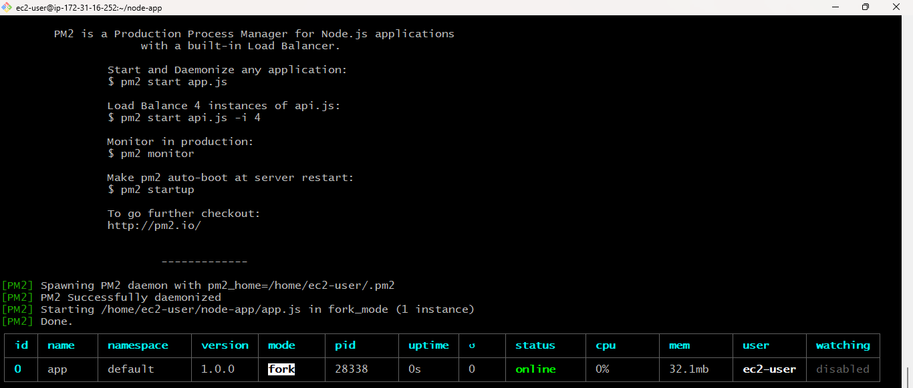
### Summary:
Deployed a Node.js app on Amazon Linux EC2 with Node.js, npm, and Git, Configured Security Group, tested the app, and used pm2 for continous running. App is accessible via the server's public IP.